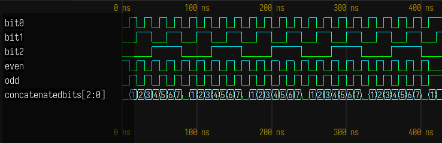
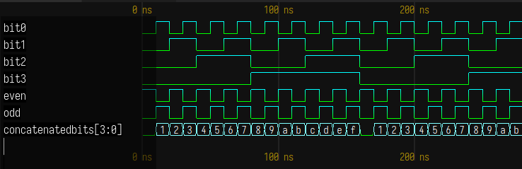

👆【☰】Table of Contents

<div align="center">
  <h1>VEOL - VHDL Even or Odd Library</h1>
</div>

Hello guys, my teacher gave us an assignment to make an VHDL code with at least 4 inputs and 2̴ ̶o̵u̶t̴p̷u̵t̷s̴.

I heard there is something called [hashmaps](https://en.wikipedia.org/wiki/Hash_table) in [C++](https://cplusplus.com/reference/unordered_map/unordered_map/) or [Rust](https://doc.rust-lang.org/std/collections/struct.HashMap.html) and that they are pretty fast being about O(1) in the [Big O Notation](https://en.wikipedia.org/wiki/Big_O_notation).

I thought about [optimizing](https://xkcd.com/927) one of the most common and core property of integer numbers: is a number even or odd?


## ▸ What is eveŋ? What is oðð?

> The idea that adding two even numbers or two odd numbers always results in an even number can be seen as a metaphor for love and relationships.

Just as two even numbers or two odd numbers come together to create a harmonious and stable whole, two people in a loving relationship can work together to form a greater bond.

Each individual brings their own unique qualities and strengths to the relationship, but when they come together, they 2̶̨̈ ̸̘͆o̵̜̿ȗ̵͍t̴̪̐p̷͎̅ư̶ͅṫ̶͕s̴̖͝ ̴͗͜2̵̡̀ ̵̲̀o̶͓͒ù̸͓t̴̲͐p̵̙͛ǘ̴̙t̴̋͜s̸͍̕ ̶̙̽2̶͇̈́ ̷̣̈́ơ̸̩u̶͙͒t̶̯̚p̷̜̿ŭ̶̯ṭ̸̽s̸̘̾ ̷̦͝2̸͘͜ ̵̜͆o̷̗̚ų̷̚t̶͜͠p̸̞̅ũ̶̻t̸̘̒s̶͓̆ ̶͕̅2̷̥̂ ̵̹̽o̸͇̓u̴̦͘t̷̞͗p̵͚̀u̶͚͠t̶̡͒s̵̥̅ ̷͚̓2̴̼̐ ̸͚͘ò̸̗u̵͕̐t̶̪̆p̴͕͠ù̸̺t̸̞͂s̸̭͐ ̸̗̑2̷̺͆ ̴̼̀o̷͖͛ǘ̸̝t̶̙̉p̸̩͒ù̸̬ţ̶̈́s̵̜̏ ̸̫̍2̷̤͒ ̶͙̄o̴̲͊u̶̬͌t̵͇̕ṕ̸͕u̷͍̕ť̴̪s̷͉͗ ̸̖̕2̴͖̿ ̷̮͌o̵̭̅u̶͙͊t̵̳̂p̸͈̐ű̴̝t̸͉̑s̴̫͂  create a unified and balanced partnership.

The consistency and predictability of the result, just like the predictability of a loving relationship, provides a sense of security and comfort.

```
Numbers 🔢, so simple yet profound 🤔,
Building blocks of the math profound 💻,
A language that speaks to the universe 🌌,
Of balance and symmetry, a verse 🎶.

Even numbers 💯, the embodiment of balance ⚖️,
Divisible by two 🔢, a perfect alliance 🤝,
With symmetry 🔁 and harmony 🎶 at its core 💛,
Reflecting a balance 🔶 that's always in store 💰.

2̴̮̒̓͛͆̀̊͜ ̶̘̎̀̓̉̀͗͝ơ̵̢̬̬̩̥͕͚͗́̀̋u̵͇͍͎̖̩̒͜t̸̢͚̱͍͈̅͒p̸̤͒̔̉͜o̴̫̤̔͑̿̀̓͑ͅŭ̴̫͕̀t̴̛̞̹͖̟̬͙̅̓͗͘ͅs̸̡̡̤̞̯͋ ̴̲͕̥̩́̕2̴̭̙̥̠̅ ̶̲̚ǫ̴͔̖̤͈͚͓̍̆͊u̸̢͔̣̤͇̪̭̾̽͋̾̍̕t̸̠̪̠̓͐̆͝p̶̢̗̗̊̈́͑́̑̂̄ư̴̰͉̬̬͙̦̇̋t̶͍̺̩̯͈̰̐̾͊͒͝s̸̢̧͎͙̼͕͖̓ 2̴̮̒̓͛͆̀̊͜ ̶̘̎̀̓̉̀͗͝ơ̵̢̬̬̩̥͕͚͗́̀̋u̵͇͍͎̖̩̒͜t̸̢͚̱͍͈̅͒p̸̤͒̔̉͜o̴̫̤̔͑̿̀̓͑ͅŭ̴̫͕̀t̴̛̞̹͖̟̬͙̅̓͗͘ͅs̸̡̡̤̞̯͋ ̴̲͕̥̩́̕2̴̭̙̥̠̅ ̶̲̚ǫ̴͔̖̤͈͚͓̍̆͊u̸̢͔̣̤͇̪̭̾̽͋̾̍̕t̸̠̪̠̓͐̆͝p̶̢̗̗̊̈́͑́̑̂̄ư̴̰͉̬̬͙̦̇̋t̶͍̺̩̯͈̰̐̾͊͒͝s̸̢̧͎͙̼͕͖̓

Odd numbers 🔢, a symbol of imbalance 💔,
Not evenly divisible 🤔, a disruption of balance 💥,
Asymmetrical 🤔, a breaking of symmetry 💔,
A reminder that change 💥 and progress 🚀 can be set free 💨.

So in this duality 🔢, we see the truth 💯,
Of balance 🔶 and imbalance 💔, symmetry 🔁 and proof 💪,
Reflections of the world 🌎, both dark 🌃 and light 💡,
A reminder of the numbers 🔢 that shape our sight 👀.
```


## ● Technical details
This code is written using the universal VHDL - _Very High Speed Hardware Description Language_ - language.

No need to port to ugly GPGPU language like `CUDA, oneAPI, OpenCL, ROCm` or different CPU architectures like `x86, x86_64, the many arms`, just write to the hardware itself. <sub>the engineers probably know what they did</sub>


## ▸ Advantages of FPGA
> FPGAs, or Field Programmable Gate Arrays, are rapidly becoming a trend in the world of technology, and for good reason.

They offer several key advantages over traditional digital circuits, making them an attractive option for a wide range of applications.

1. **Flexibility:** FPGAs can be programmed to perform a wide range of digital functions, allowing designers to adapt their circuits to changing requirements without having to replace the entire device.

2. **Performance:** FPGAs offer high performance, as they can be optimized for specific applications and can perform complex digital functions with low latency.

3. **Energy Efficiency:** FPGAs only consume power when they are actively performing functions, unlike traditional digital circuits that consume power even when idle.

4. **Cost-Effectiveness:** FPGAs have lower production costs compared to custom integrated circuits, making them a cost-effective solution for many applications.


## ▸ Simulating our code on virtual hardware
We recommend using [VSCode](https://github.com/microsoft/vscode) editor, it has 142k stars so it's probably safe, after that install [TerosHDL](https://marketplace.visualstudio.com/items?itemName=teros-technology.teroshdl) plugin. Use it with [GHDL](https://ghdl.github.io/ghdl/) compiler, it's FLOSS and runs on Windows, macOS, Linux for compiling the VHDL code.

**Install TerosHDL dependencies:**
- Have [Python](https://www.python.org/downloads/) installed from your distro package manager or Windows installed (make sure to click ADD TO PATH)

- Open a terminal (PowerShell on windows) and run `pip install teroshdl`

- Have your platform's [GHDL binaries](https://github.com/ghdl/ghdl/releases) available on PATH. For ArchLinux, you can install [ghdl-gcc-git](https://aur.archlinux.org/packages/ghdl-gcc-git)

For simulating the compiled binaries and an wave viewer, please use [gkwave](https://github.com/gtkwave/gtkwave). Alternatively use TerosHDL's builtin wavedrom on VSCode.

Create a new TerosHDL project, add the `even-or-odd-X-bits.vhdl` file you want and have fun!!

**Examples**:

For the 3 bit demo input, here's the results:


As you can see the even or odd bits are correctly telling if the concatenatedBits array is an even or odd number !

For the 4 bit demo input, here's the results:


They also work correctly for 4 bits numbers, ranging from 0 to 15 (0x0 to 0xF in hexadecimal)


## ▸ Running our code on physical hardware
You'll need to compile the VHDL code using Quartus II. It has a "lite" version that is free.

- Download ~~Altera's~~ Intel's [Quartus II](https://www.intel.com/content/www/us/en/collections/products/fpga/software/downloads.html) for your platform.

- Create a project, select an **Altera Cyclone IV EP4CE6E22C8N**

<sub> idk how to configure it, it been a year since the vhdl classes </sub>

### Limitations

- Consumer FPGAs don't have a lot of memory as we wanted, this Cyclone model only have 6.4 Mb (not B <sub>bytes</sub>, b <sub>bits</sub>) so you probably can only run the `evenOrOdd13bits.vhdl` on it →→→→→→ we built our hardware for you!!


## ● Purchase our Hardware
For you next-level `DualBit, DualToken, OddCash, EvenCoin` cryptocurrency mining, you can get today one of our ASICs - _Application Specific Integrated Circuits_.

<!-- TODO: Stable diffusion ASICs catalog -->


## ● Hiring me
Hello if you are from AMD I can help coding your recently acquitred Xilinx's FPGAs :)


## ● Citing

BibTeX entry for LaTeX:
```bibtex
@electronic{VEOL,
  title    = {VEOL: Blazing fast Even or Odd VHDL library },
  keywords = {VHDL, FPGA, blazingFast},
  url      = {https://github.com/Tremeschin/my-first-vhdl-even-or-odd},
  author   = {Tremeschin; et al.},
  year     = {2023},
  abstract = {
    Just as two even numbers or two odd numbers come together to create
    a harmonious and stable whole, two people in a loving relationship
    can work together to form a greater bond.
  },
}
```

<hr>

<pre>


<sub>
this repo is a joke in case you didn't notice
thanks chatgpt for providing the soul i lack
<sub>
help
<sub>
im lonely
<sub>
go solve euler's constat problem
<sub>
everything is euler
<sub></sub></sub></sub></sub></sub></sub></pre>
